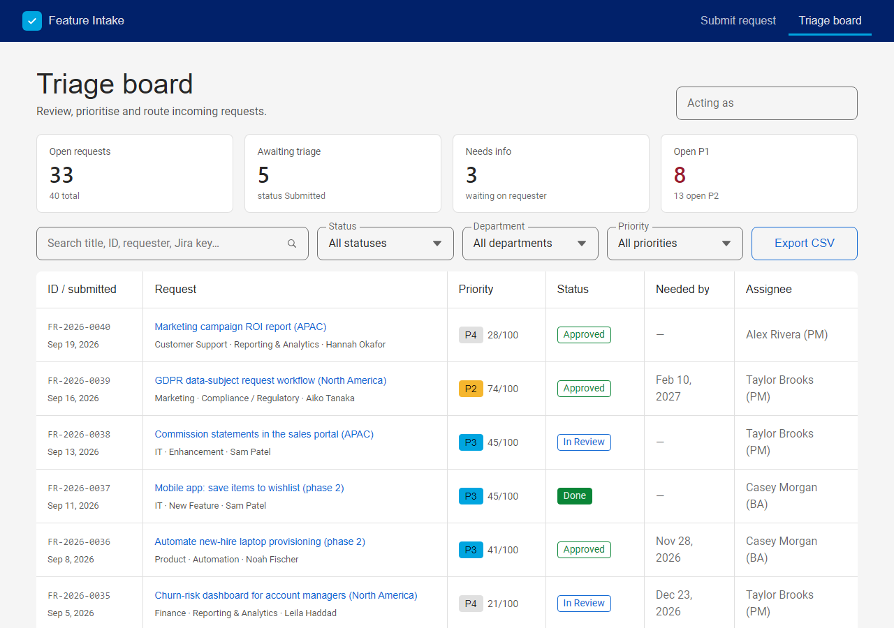
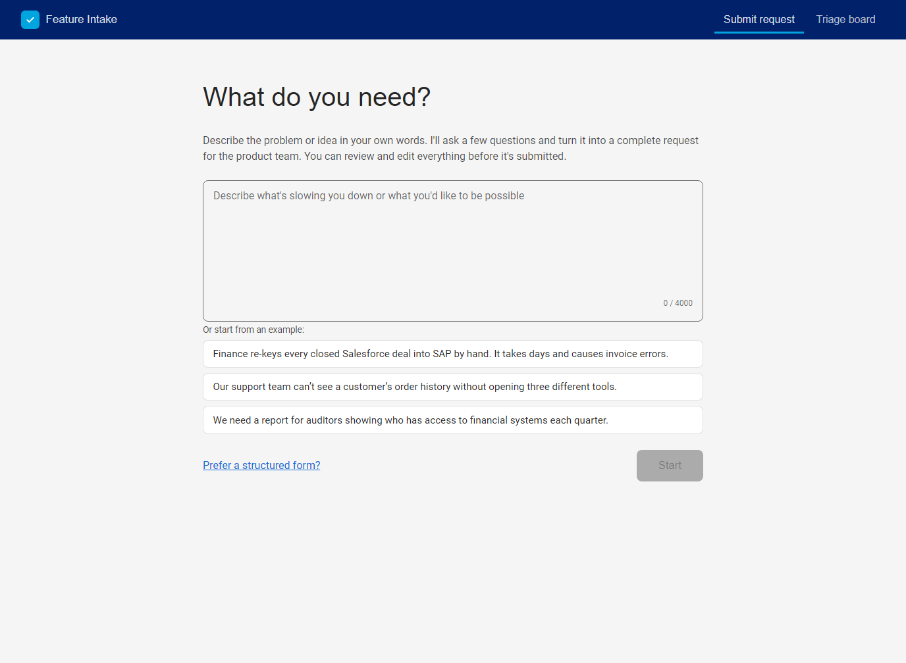
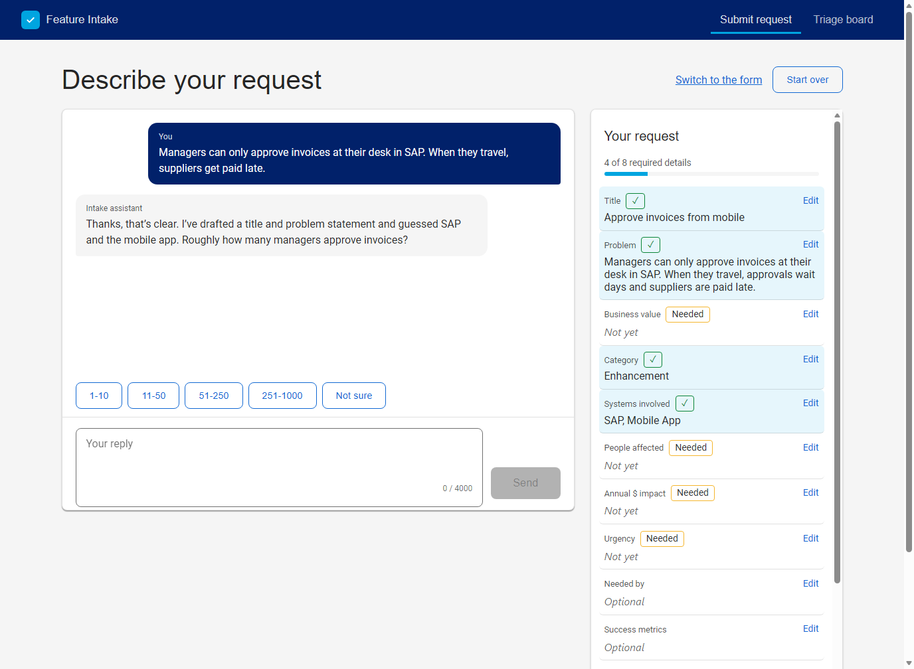
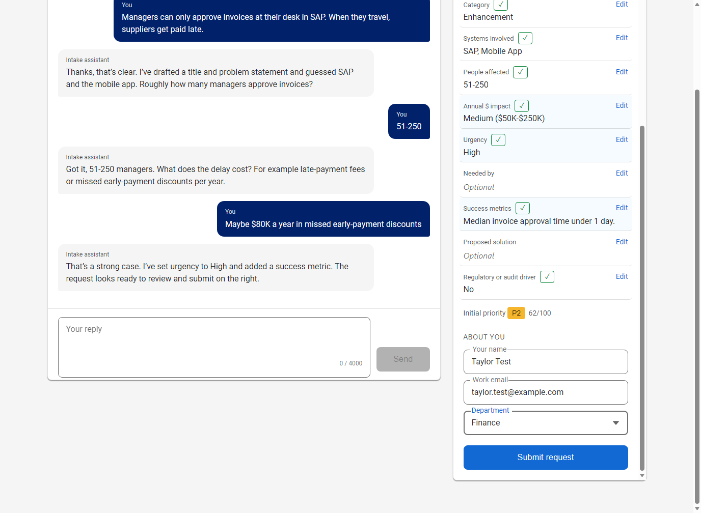
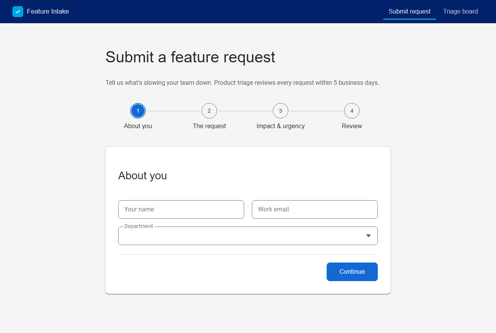
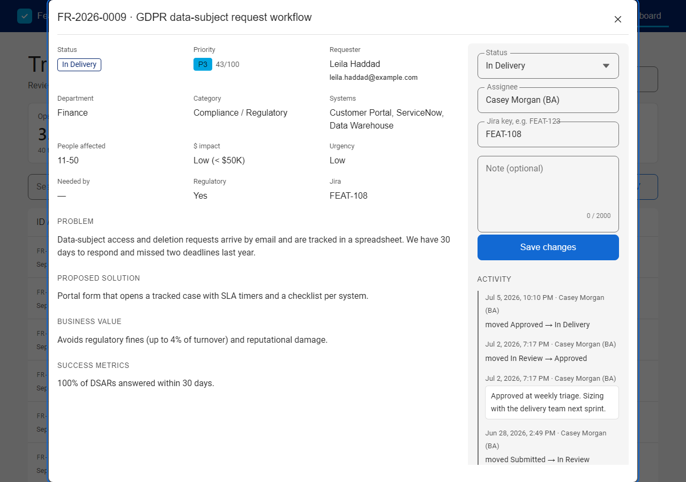
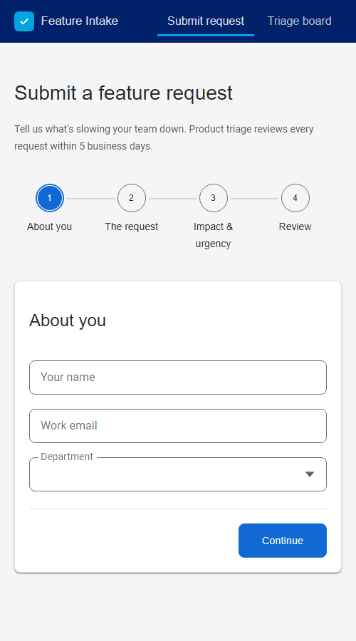
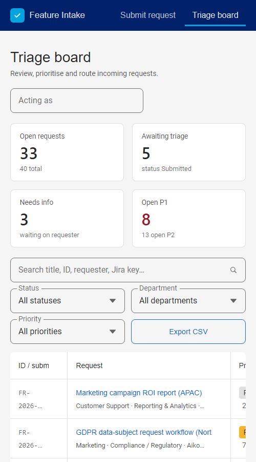
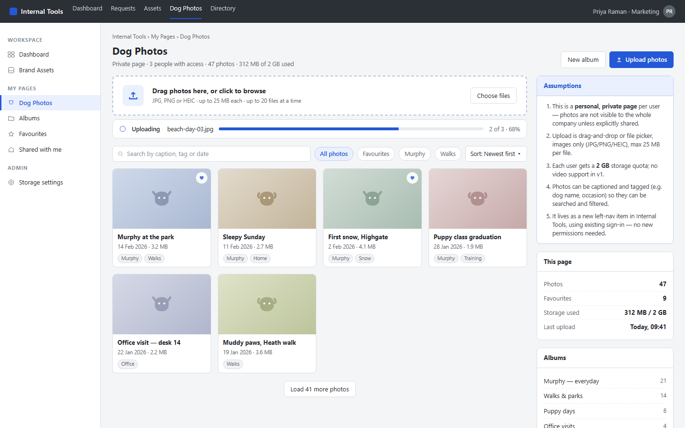

# Feature Intake

An AI-guided intake where business users describe a feature request in their own words, and a triage board where product teams review, score and route requests.

- **Describe it, don't fill it in.** The requester explains the problem in plain language. Claude asks a few targeted follow-up questions, with tap-to-answer suggestions, and builds a complete, structured request in a live panel beside the chat. Every field stays editable, and the same validation rules as the form decide when it's ready to submit.
- **See it.** After submission, Claude sketches a **concept mock UI** of the idea. The requester sees it on the confirmation screen and triage sees it on the board. Either can regenerate it with feedback.
- **No AI? No problem.** Without an API key, `/` serves the classic 4-step form, which is also always available at `/form`.



## Screenshots

### AI-guided intake

| Describe it in your own words | The assistant asks follow-ups and fills the request live |
|---|---|
|  |  |



*The conversation in these screenshots was scripted with a stand-in for Claude so the images are reproducible; the UI is the real app.*

### Classic form and triage

| Intake form (`/form`) | Request detail and triage |
|---|---|
|  |  |

| Intake on a phone | Triage board on a phone |
|---|---|
|  |  |

### Sample concept mock

Real output for request **FR-2026-0043**, generated by `claude-opus-5` at the default `medium` effort. The request was deliberately thin:

> - **Title:** Create a new page for uploading dog photos
> - **Problem:** I dont have a place to store and look at my dogs photos
> - **Business value:** I like looking at my dog and it saves me time
> - **Category:** New Feature · **Systems:** Internal Tools · **People affected:** 1-10



From three sentences, Claude placed the page inside the requester's existing tool (a new *My Pages → Dog Photos* item in the Internal Tools navigation). It filled in what the request didn't say: drag-and-drop upload with a progress bar, tags and search, favourites, albums, and a storage quota. It listed those guesses in the **Assumptions** panel (private per user, JPG/PNG/HEIC up to 25 MB, a 2 GB quota, no video in v1) so the requester can correct them before anyone builds anything. The person shown in the header is made up: requester names and emails are never sent to the model.

The generated page is in [`docs/mocks/samples/FR-2026-0043-dog-photos.html`](docs/mocks/samples/FR-2026-0043-dog-photos.html) (download and open it locally; GitHub shows HTML as source). In the app it appears on the confirmation screen and in the triage dialog, in a sandboxed frame with a *Regenerate with feedback* box.

## Quick start

Requires Node.js 22.12 or later. The front end is React 18 built with Vite and styled with [Backyard](https://github.com/lowes/backyard-design-system), Lowe's open-source design system (`@lowes-tech/bds-react`, `bds-tokens`, `bds-icons`).

```bash
npm install                          # server: @anthropic-ai/sdk; front end: React, Vite, Backyard
export ANTHROPIC_API_KEY=sk-ant-...  # optional: turns on concept mocks
npm run seed   # optional: load 40 demo requests

npm run dev    # development: API on :3000 + Vite on http://localhost:5173 (hot reload, /api proxied)

npm run build  # production: builds the React app into web/dist
npm start      # serves API + built app on http://localhost:3000  (form)  and  /requests  (triage board)

npm test       # 67 server tests: rules, API, intake assistant, concept mocks (no network; the Claude API is faked)
```

## What's here

| Path | Contents |
|---|---|
| `web/` | React front end (Vite). `src/pages/AssistantIntake.jsx` + `src/components/DraftPanel.jsx` (AI-guided intake), `src/pages/IntakePage.jsx` (classic 4-step form), `BoardPage.jsx` + `RequestDetail.jsx` (triage board and modal), `src/components/` (header, badges, concept-mock viewer), `src/theme/GlobalStyles.js` (Backyard tokens and fonts) |
| `shared/` | `rules.js`: validation, scoring and workflow as an ES module, imported by the React app and `require`d by the server |
| `scripts/dev.js` | Starts the API and the Vite dev server together |
| `server/` | Node HTTP server: `app.js` (API + static files), `store.js` (atomic JSON persistence), `assistant.js` (Claude intake assistant), `mockgen.js` (Claude concept-mock generation queue), `seed.js` |
| `tests/` | `node:test` suites for rules, API, intake assistant and concept mocks |
| `test-data/` | Deterministic generator plus `seed.json`, `requests.csv`, `valid-payload.json`, `edge-cases.json`, `invalid-payloads.json` |
| `docs/confluence/` | Confluence-ready pages: home, PRD, architecture, API, data model, process, test strategy, runbook, ADRs |
| `docs/jira/` | `jira-import.csv` (7 epics, 40 stories for the Jira CSV importer) and `backlog.md`, both generated by `backlog.js` |
| `docs/architecture/` | Mermaid sources (`.mmd`) and rendered `.svg` for 10 diagrams |
| `docs/api/openapi.yaml` | OpenAPI 3 contract |
| `docs/mocks/` | `screenshots/` of the real app, `samples/` with a real generated concept mock, and `wireframes.html` with Phase 2 mockups (SSO, My requests, emails, Teams, Jira) |

## Regenerating artefacts

```bash
npm run gen:data                   # test-data/*
node docs/jira/backlog.js          # docs/jira/jira-import.csv + backlog.md
node docs/architecture/extract.js  # docs/architecture/*.mmd from the Confluence pages
npx -y @mermaid-js/mermaid-cli -i docs/architecture/02-mvp-containers.mmd -o 02-mvp-containers.svg
```

Screenshots are taken with headless Edge or Chrome against a running, seeded server:

```bash
msedge --headless=new --window-size=1280,900 --virtual-time-budget=4000 --screenshot=board.png http://localhost:3000/requests
```

## Importing into Confluence and Jira

- **Confluence:** paste each page from `docs/confluence/` using the Markdown option of the *Insert* menu, or the *Markdown* macro. For diagrams, use a Mermaid macro or upload the SVGs from `docs/architecture/`.
- **Jira:** go to *Settings → System → External System Import → CSV*, choose `docs/jira/jira-import.csv`, and map *Parent Id → Parent* so stories are linked to their epics. See `docs/jira/backlog.md` for the full mapping.

## Configuration

| Env var | Default |
|---|---|
| `PORT` | `3000` |
| `HOST` | `127.0.0.1`. The MVP has no login, so it only listens locally; set `0.0.0.0` (as in a container) only behind SSO or a VPN |
| `STATIC_DIR` | `./web/dist` (the built React app) |
| `DATA_FILE` | `./data/requests.json` (mocks are stored in `mocks/` next to it) |
| `ANTHROPIC_API_KEY` | unset. When set, concept mocks turn on |
| `MOCKS` | `auto` (on when a key is set), or `on` / `off` |
| `MOCK_MODEL` | `claude-opus-5` |
| `MOCK_EFFORT` | `medium`. Higher means better mocks but a longer wait (`low` … `max`) |
| `ASSIST` | `auto` (on when a key is set), or `on` / `off`. Off means `/` serves the classic form |
| `ASSIST_MODEL` | `claude-opus-5` |
| `ASSIST_EFFORT` | `low`, so chat turns feel quick. Raise it for more thorough questioning |

**AI features and privacy:** what the requester types in the intake chat, and each request's title, problem, solution, value, metrics, department and systems (for concept mocks), are sent to the Anthropic API. The requester's name and email are entered outside the chat and are never sent. The chat transcript is saved with the submitted request so triage can see how it took shape. Set `ASSIST=off` and `MOCKS=off` if that isn't acceptable for your data. Generated HTML is sanitised and shown in a sandboxed iframe, so it can't run scripts or load anything.

> The MVP has no in-app authentication (see ADR-004). Run it behind an SSO proxy or VPN until Phase 2.
