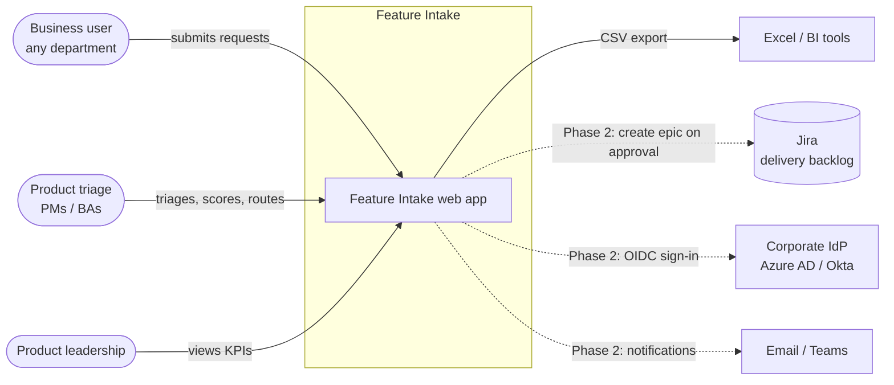
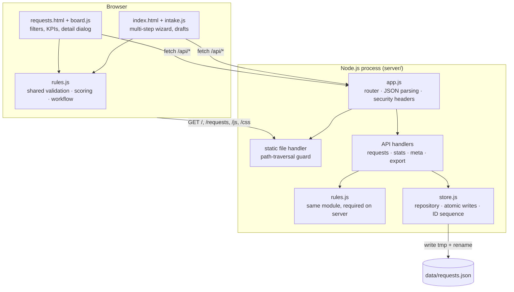
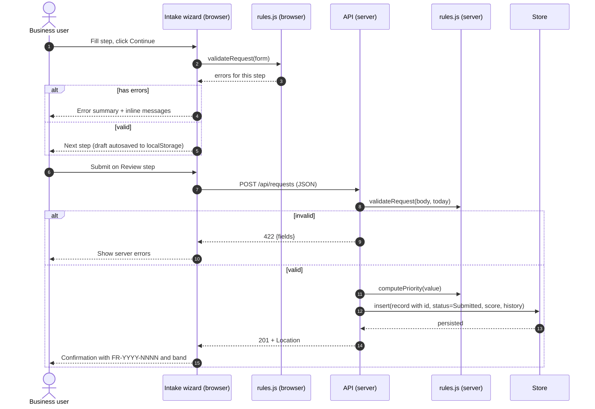
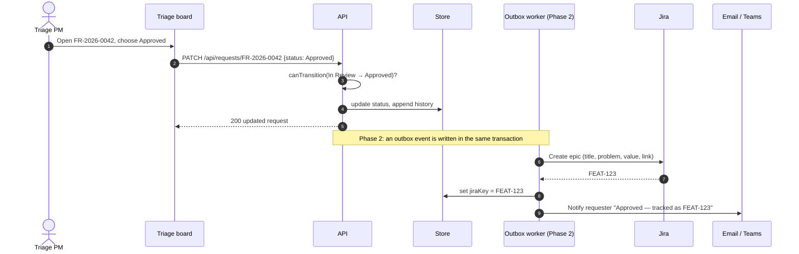
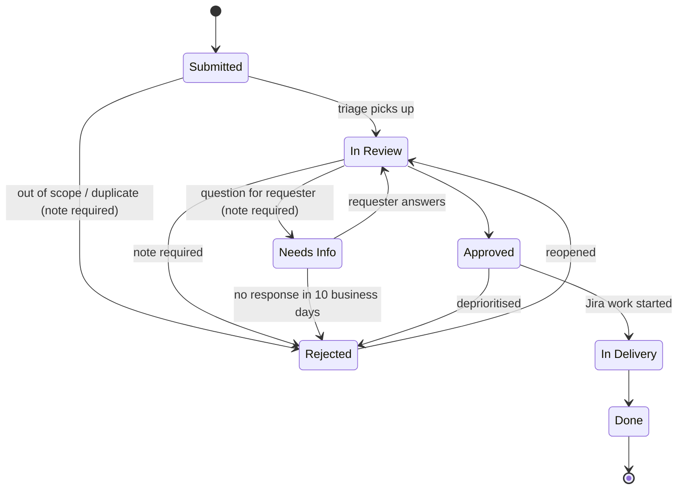
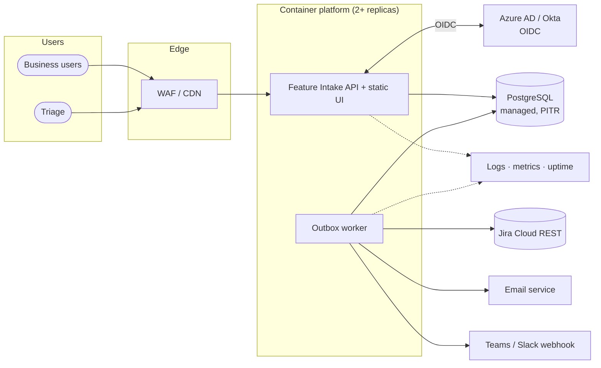
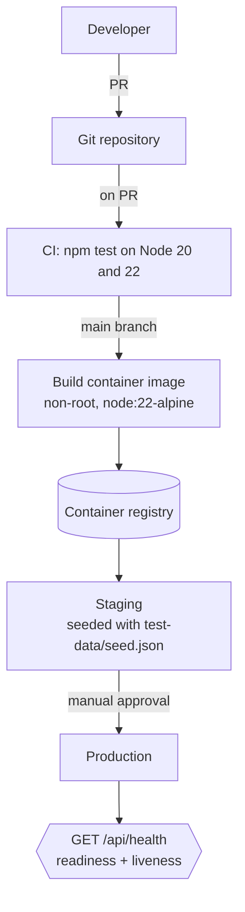

# Feature Intake — Solution Architecture

| | |
|---|---|
| **Status** | Draft for review |
| **Owner** | Engineering lead, Feature Intake |
| **Last updated** | 2026-09-23 |
| **Related** | [PRD](01-product-requirements.md) · [API reference](03-api-reference.md) · [Data model](04-data-model.md) · [Decision log](08-decision-log.md) |

> **Confluence tip:** diagrams are written in Mermaid. Paste each ```` ```mermaid ```` block into a *Mermaid Diagrams for Confluence* macro, or render PNG/SVG with `npx @mermaid-js/mermaid-cli -i docs/architecture/<name>.mmd -o <name>.svg`. The source files live in `docs/architecture/`.

## 1. Summary

Feature Intake is a small web application with two surfaces: an **intake form** that business users fill in, and a **triage board** where product managers review, score and route requests. The MVP is a single Node.js process with no third-party runtime dependencies. It serves static HTML/CSS/JS and a JSON REST API, and keeps its data in a JSON file. Phase 2 adds SSO, a managed PostgreSQL database, Jira sync and notifications without changing the API contract.

**Design principles**

1. **One set of rules.** Validation, enums, scoring and workflow live in a single module (`public/js/rules.js`) that runs in the browser and on the server, so the two cannot drift apart.
2. **The server is authoritative.** The client validates for a better experience; the server re-validates everything and owns IDs, status, score and history.
3. **Boring and replaceable.** Zero dependencies, a repository interface around storage, and an OpenAPI contract, so any layer can be swapped.
4. **Auditable by default.** Every status and field change is appended to the request's history with who did it and when.

## 2. System context



## 3. MVP containers and components



| Component | Responsibility | Key file |
|---|---|---|
| Intake wizard | 4-step form, per-step validation, localStorage drafts, review, confirmation | `public/index.html`, `public/js/intake.js` |
| Triage board | KPIs, filter/search/sort, detail dialog, workflow actions, CSV export link | `public/requests.html`, `public/js/board.js` |
| Rules | Enums, field limits, `validateRequest`, `computePriority`, `canTransition` | `public/js/rules.js` |
| HTTP/API | Routing, body limits (100 KB), content-type checks, error mapping, CSV | `server/app.js` |
| Store | In-memory list + serialized atomic file writes; sequential IDs | `server/store.js` |

## 4. Key flows

### 4.1 Submit a request



### 4.2 Triage decision (Phase 2 shows Jira and notifications)



## 5. Request lifecycle



The transition table is defined once in `rules.js` (`TRANSITIONS`) and enforced by the API. The UI only offers legal next states.

## 6. Priority scoring

| Input | Points |
|---|---|
| People affected (1-10 … 1000+) | 7, 14, 21, 28, 35 |
| Annual $ impact (None … > $1M) | 7, 14, 21, 28, 35 |
| Urgency (Low, Medium, High, Critical) | 0, 10, 20, 30 |
| Regulatory / audit driver | +15 |
| **Total** | capped at 100 |

Bands: **P1** ≥ 75 · **P2** ≥ 55 · **P3** ≥ 35 · **P4** < 35. The score is a starting point for triage, not a decision. It is recomputed only at submission; triage records overrides as notes.

## 7. Target architecture (Phase 2)



Changes from MVP:

- **Identity:** OIDC login. Requester fields come from ID token claims. The triage board needs the `intake-triage` group. `actor` in the API is replaced by the authenticated user.
- **Persistence:** `store.js` is replaced by a PostgreSQL repository with the same methods (`list/get/insert/save`). A migration script imports `requests.json`.
- **Integrations:** a transactional outbox (an `events` table) with a worker that calls Jira, email and Teams, with retries and a dead-letter queue. Status changes never block on third parties.
- **Scale:** the app becomes stateless and can run as multiple replicas behind the load balancer.

## 8. Deployment (target)



| Setting | Env var | Default |
|---|---|---|
| HTTP port | `PORT` | `3000` |
| Data file (MVP) | `DATA_FILE` | `./data/requests.json` |
| Database URL (Phase 2) | `DATABASE_URL` | — |
| OIDC issuer / client (Phase 2) | `OIDC_ISSUER`, `OIDC_CLIENT_ID`, `OIDC_CLIENT_SECRET` | — |
| Jira (Phase 2) | `JIRA_BASE_URL`, `JIRA_PROJECT`, `JIRA_TOKEN` | — |

## 9. Cross-cutting concerns

**Security**
- CSP `default-src 'self'`, no inline script or style, `frame-ancestors 'none'`, `nosniff`, `Referrer-Policy: same-origin`.
- All user text reaches the DOM through `textContent`, never `innerHTML`.
- Body size limit of 100 KB; JSON only (415 otherwise); control characters stripped.
- Static handler normalises paths and refuses anything outside `public/`.
- CSV export prefixes cells starting with `= + - @` to block spreadsheet formula injection.
- **MVP gap:** no authentication. Deploy behind VPN/SSO proxy until Phase 2 (see decision ADR-004).

**Privacy.** Stored personal data is limited to requester name and work email. Retention: 3 years after Done/Rejected, then anonymise (Phase 2 job).

**Accessibility.** Target WCAG 2.1 AA: labelled controls, error summary with focus management, `aria-invalid`/`aria-describedby`, keyboard-operable rows and dialog, and light and dark themes.

**Observability.** MVP: `/api/health` and stderr logging of unhandled errors. Phase 2: structured JSON logs, RED metrics, and a 5xx alert.

**Performance.** In-memory filtering is fine up to roughly 10k requests. Beyond that, the PostgreSQL move adds indexes on `status`, `priority_band`, `created_at` and a trigram index for search.

## 10. Risks

| Risk | Likelihood | Impact | Mitigation |
|---|---|---|---|
| No auth in MVP exposes triage actions | High if on open network | High | Host behind SSO proxy / VPN; Phase 2 OIDC |
| JSON file store limits to one instance | Certain | Medium | Single replica for MVP; Postgres in Phase 2 |
| Score perceived as "the decision" | Medium | Medium | Label as estimate; triage notes record overrides |
| Low adoption, requests keep arriving by email | Medium | High | Comms plan, auto-reply pointing to the form (see Process page) |
