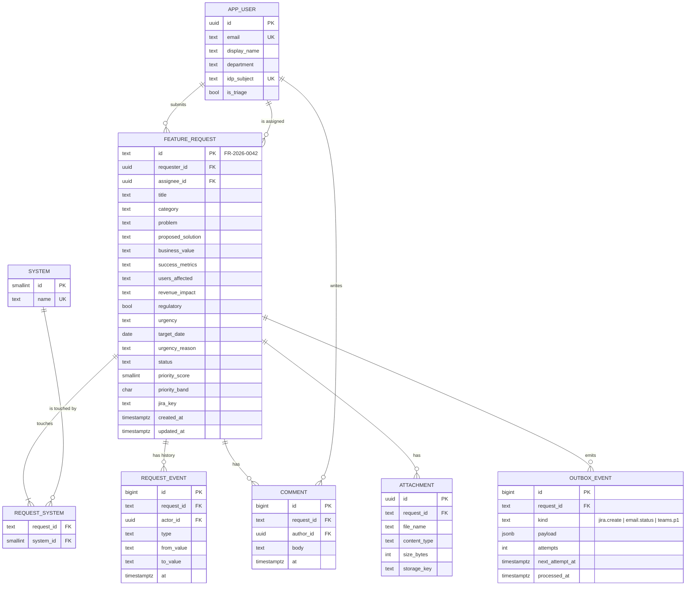

# Feature Intake — Data Model

## MVP: document store

Each request is one JSON document in `data/requests.json`:

```json
{
  "seq": 40,
  "requests": [ { "id": "FR-2026-0001", "...": "..." } ]
}
```

`seq` is the last issued sequence number. IDs are `FR-<UTC year>-<seq, 4 digits>`. The sequence does not reset each year, so IDs stay unique even though they are not dense per year.

### FeatureRequest fields

| Field | Type | Set by | Notes |
|---|---|---|---|
| `id` | string | server | `FR-2026-0042` |
| `requesterName` | string 2–100 | requester | trimmed |
| `requesterEmail` | string ≤ 254 | requester | lower-cased |
| `department` | enum | requester | see Enums |
| `title` | string 5–120 | requester | |
| `category` | enum | requester | |
| `problem` | string 20–4000 | requester | |
| `proposedSolution` | string ≤ 4000 | requester | optional |
| `businessValue` | string 20–4000 | requester | |
| `successMetrics` | string ≤ 2000 | requester | optional |
| `affectedSystems` | enum[] ≥ 1 | requester | de-duplicated |
| `usersAffected` | enum | requester | reach bucket |
| `revenueImpact` | enum | requester | annual $ bucket |
| `regulatory` | boolean | requester | |
| `urgency` | enum | requester | |
| `targetDate` | date or "" | requester | ≥ submission date; required if Critical |
| `urgencyReason` | string ≤ 1000 | requester | required if Critical |
| `status` | enum | server / triage | workflow-controlled |
| `priorityScore` | int 0–100 | server | computed at submission |
| `priorityBand` | P1–P4 | server | from score |
| `assignee` | string ≤ 80 | triage | |
| `jiraKey` | string | triage / Jira sync | `FEAT-123` |
| `createdAt`, `updatedAt` | ISO datetime | server | |
| `history[]` | `{at, actor, type, from, to}` | server | `type` ∈ status, assignee, jiraKey |
| `comments[]` | `{at, author, text}` | triage | text ≤ 2000 |

### Enums

| Enum | Values |
|---|---|
| department | Finance, Sales, Marketing, Operations, Customer Support, HR, Legal & Compliance, IT, Product, Other |
| category | New Feature, Enhancement, Integration, Reporting & Analytics, Automation, Compliance / Regulatory, Other |
| affectedSystems | Salesforce, SAP, Workday, ServiceNow, Customer Portal, Mobile App, Data Warehouse, Internal Tools, Other |
| usersAffected | 1-10, 11-50, 51-250, 251-1000, 1000+ |
| revenueImpact | None, Low (< $50K), Medium ($50K-$250K), High ($250K-$1M), Very High (> $1M) |
| urgency | Low, Medium, High, Critical |
| status | Submitted, In Review, Needs Info, Approved, Rejected, In Delivery, Done |

Enums are defined in `public/js/rules.js` and served by `GET /api/meta`. To change a list, edit that one file.

## Phase 2: relational model (PostgreSQL)



**Indexes:** `feature_request(status)`, `(priority_band, status)`, `(created_at desc)`, `(requester_id)`, and a GIN trigram index on `title || ' ' || problem` for search.

**Constraints:** `CHECK` constraints mirror the enums. Workflow transitions stay in application code (`rules.js`), so the server and UI share them.

**Migration:** `scripts/migrate-json-to-pg.js` (Phase 2 story) reads `requests.json`, upserts users by email, and inserts requests, systems, events and comments in a single transaction.

## Data classification and retention

| Data | Class | Retention |
|---|---|---|
| Requester name, email | Internal – personal | 3 years after Done/Rejected, then anonymised |
| Request content | Internal | Indefinite (product history) |
| History / comments | Internal – audit | Same as the request |
